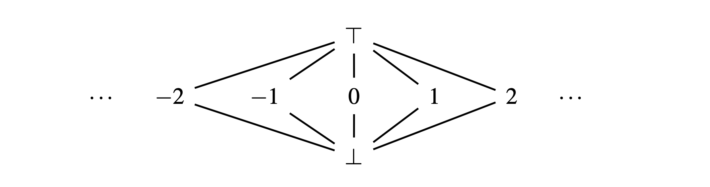
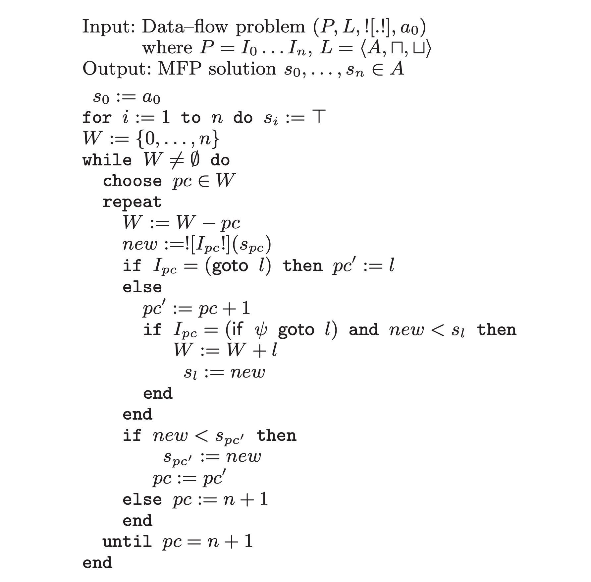
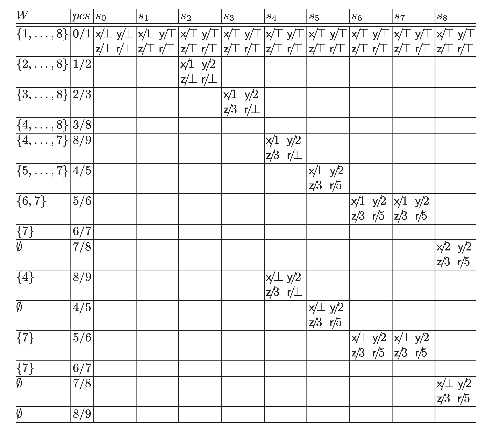

@def title = "A quick dive into Julia's type inference algorithm"
@def published_date = "2020-11-09"

{{ blogtitle }}

In this article we'll try to understand and implement a part of [Julia](https://julialang.org/)'s inference algorithm.
The technique is commonly called as "abstract interpretation" or "data-flow analysis" of a program, which is generally used for program analysis, and so I hope even those who aren't interested in Julia may enjoy this.

In this article we're going to pick up [constant folding propagation] as an example data-flow analysis problem, and actually implement it from scratch using Julia.
While constant folding propagation is one of the most common compiler optimization technique, the understanding can be easily generalized and the example implementation will help you figure out how Julia's inference routine works.

\toc

# Algorithm

In this section we will briefly introduce some notations to describe a general data-flow analysis and consider the example problem (constant folding propagation), and finally understand an algorithm to solve it.

## Data-flow problem

A \cite{dataflowprob} is defined by the following 4 components:
1. $P = I_0 ... I_n \in \text{Instr}$: a program, which consists of "instructions"
2. $L = < A, \sqcup, \sqcap >$ : [lattice] of abstract state that represent some property of $P$
3. $![.!] : \text{Instr} \rightarrow (A \rightarrow A)$: "abstract semantics" of $P$, which gives how each instruction acts on $P$'s abstract state $A$
4. $a_0 \in A$: initial state of $P$
where:
- $\text{Instr}$: basic instructions that make up a program; we can think of any kind of instruction as far as we can distinguish between instructions which cause the control flow to branch and those which keep the control flow linear
- $A$: set that represents program's state[^1]
- $\sqcup, \sqcap$: operations corresponding to [join and meet] respectively, that acts on $A$

The actual and concrete definitions of $P$, $L$, and $![.!]$ are given for each data-flow problem.

## "A Graph-Free Approach to Data-Flow Analysis"

\cite{bbgraph} proposed an algorithm that uses a graph that has nodes of [basic blocks](https://en.wikipedia.org/wiki/Basic_block) ("BB graph") as a core data structure, and it had been the _de facto_ standard algorithm to solve a data-flow problem.

\cite{graphfree} extended that algorithm so that it doesn't use a graph as an explicit data structure.

It experimentally showed that the "graph-free" approach has the following benefits:
- improved memory efficiency: in many cases, it's able to reduce the memory usage by a third, at the cost of negligible execution time trade-offs
- easy to implement: it no longer needs to build a BB graph

To help us understand the algorithm proposed in the paper, let's introduce an example data-flow problem first.

\note{Important note}{
    In the rest of this article, I'm going to refer to \cite{graphfree} as "the paper".
}

## Example problem: Constant folding propagation

This article picks up [constant folding propagation] as an example data-flow problem.
It is a common compiler optimization technique that aims at finding as many constants as possible at compile time, and replacing the runtime computations with the constant values.
So the data-flow problem for that is setup up such that it determines if a variable is constant or not at each point of the program.

So let's get started with defining 1.) program $P$, 2.) lattice $L$, 3.) abstract semantics $![.!]$, and 4.) the initial state $a_0$.

### Problem setting 1: Program $P$

For the sake of simplicity, we will assume that the program $P$ only performs operations on integers and there're only three type of instruction:
- assignment: `lhs := rhs`
- unconditional branching: `goto instruction`
- conditional branching: `condition && goto instruction`

### Problem setting 2: Lattice $L$

Let $C$ to be an abstract value that represents each variable's property.
For constant folding prop', we only need to consider the following three kinds of $C$:
- $\top$: the top element of lattice
- $c \in \mathbb{N}$: constant
- $\bot$: the bottom element of lattice

The paper gave intuitive meanings of $\top$ and $\bot$ as follows:
- $\top$: "non constant due to _missing information_"
- $\bot$: "non constant due to _conflict_"

Next, we define the ordering of $C$ as follows: $c_1 \le c_2$ iff a) $c_1 = c_2$, b) $c_1 = \bot$, c) $c_2 = \top$

So $C$ forms the flat lattice as shown in the following image:
\relasset{}
@@caption Hasse diagram of $< C, \sqcup, \sqcap > $ @@

The abstract state $A$ for each instruction of $P$ can be represented as the following map, where $X$ is the set of variables in $P$:

$$
    A := X \rightarrow C
$$

Finally, we can think of meet and join operations on abstract state $A$ ($\sqcap_A$, $\sqcup_A$) as the per-variable uses of corresponding operation on abstract value $C$.

### Problem setting 3: Abstract semantics $![.!]$

Let's consider the abstract semantics $![.!]$ of program $P$. Each instruction of $P$ has the following effect on abstract state:
- assignment (`lhs := rhs`): assigns `rhs` to `lhs` only when `rhs` is known to be constant, otherwise assign $\bot$ to `lhs`
- unconditional branching (`goto instruction`): doesn't change the abstract state
- conditional branching (`condition && goto instruction`): doesn't change the abstract state
@@caption Abstract semantics $![.!] $@@

### Problem setting 4: Initial program state $a_0$

While the paper explains that the initial state of program in constant folding prop' problem should be initialized with $\bot$, it's probably wrong.
Rather, $P$ should be initialized with $\top$ for this problem; Intuitively, at the initial state, each variable in $P$ should be interpreted as "non constant due to _missing information_" rather than "non constant due to _conflict_".

$$
    a_0 := X \rightarrow \top
$$

## The graph-free algorithm

Now we've set up the data-flow problem.
The paper proposed the following algorithm to solve it: [^2]

\relasset{}
@@caption The graph-free algorithm @@

Intuitive understandings of this algorithm are:
1. the program itself acts on its abstract state at instruction level via abstract semantics $![.!]$
2. the algorithm works by updating the current program counter $pc$, which corresponds to the current instruction $I_{pc}$, and the working set $W$, which holds the rest of the instructions to be computed
3. the abstract state of the current instruction $I_{pc}$ propagates to states of all the instructions that $I_{pc}$ may reach
4. however, the abstract state of the current instruction $I_{pc}$ propagates only if it "changes" the abstract state of an instruction to which it propagates

\raw{3.} corresponds to $I_{pc} = (\text{if} \psi \text{goto} l)$ in the algorithm.
This means, the algorithm accounts for both branches at the conditional branching, unlike the actual program execution.

\raw{4.} corresponds to $\text{if} new < s_{pc'}$ and $\text{if} new < s_{l}$ in the algorithm.
The paper uses the ordering relation $<$ in the lattice $L$ of the abstract state $A$ as the condition to check whether or not he abstract state of the current instruction "changes" the abstract state of an instruction to which it propagates.
In other word, if $\text{if} new < s_{pc'}$ doesn't hold we consider the abstract state has "converged" (and finally the algorithm will terminate after all the abstract states for each instruction has converged).
The paper also explains that $<$ is equivalent to the following condition:

$$
    new < s_{pc'} \equiv (new \sqcap s_{pc'} = new) \land (new \ne s_{pc'}) \label{strict ordering relation between abstract states}
$$

That is, $new$ (abstract state of the current instruction $I_{pc}$) is propagated to $s_{pc'}$ (abstract state of the next instruction $I_{pc'}$) only when $new$ is lower than $s_{pc'}$ in the lattice $L$[^3].
Thus, the abstract state $A$ for each instruction is _always_ updated in a way that it transitions towards the bottom of $L$, so that this algorithm will always converge given lattice $L$ with finite height.

## Example program `prog0` and example algorithm tracing

As an concrete example of the program $P$, suppose we have the following program `prog0`:
```
0 ─ I₀ = x := 1
│   I₁ = y := 2
│   I₂ = z := 3
└── I₃ = goto I₈
1 ─ I₄ = r := y + z
└── I₅ = if x ≤ z goto I₇
2 ─ I₆ = r := z + y
3 ─ I₇ = x := x + 1
4 ─ I₈ = if x < 10 goto I₄
```

@@caption Example program: `prog0` @@
(The leftmost numbers correspond to basic blocks. They're not used by the algorithm presented in this article.)

The paper shows the following tables as the example tracing of the algorithm running on `prog0`:
\label{tracing-example}
\relasset{}
@@caption The paper's tracing example on `@prog0` @@

We can see that at the final state $s_8$ ($\text{x}/\bot \text{y}/2 \text{z}/3 \text{r}/5$), the algorithm obtains the information that "`r` is a constant `5`", which doesn't appear in `prog0`.


# Implementation

Phew, such a long preface. Now let's express the data-flow problem and implement the algorithm using Julia !
As in the previous section, we first setup the problem, and then tackle the algorithm.
The full code can be found at <https://github.com/aviatesk/aviatesk.github.io/blob/main/posts/assets/data-flow-problem-20201109/dataflow.jl>.

\note{Acknowledgement}{
The code below was originally adapted from <https://github.com/JeffBezanson/dataflow.jl/blob/c21a6737a8d877c244bef590d207d868f6744d3a/dataflow.jl> under the MIT license.
}

## Example problem: Constant folding propagation example

### Problem setting 1: Program $P$

\weave{
```julia
abstract type Exp end

struct Sym <: Exp
    name::Symbol
end

struct Num <: Exp
    val::Int
end

struct Call <: Exp
    head::Sym
    args::Vector{Exp}
end

abstract type Instr end

struct Assign <: Instr
    lhs::Sym
    rhs::Exp
end

struct Goto <: Instr
    label::Int
end

struct GotoIf <: Instr
    label::Int
    cond::Exp
end

const Program = Vector{Instr}
```
}

### Problem setting 2: Lattice $L$

Now we will express the abstract state $A := X \rightarrow C$ of an instruction that composes program $P$.

First, we define $C$, abstract value that a variable $X$ can have, and their order:
\weave{
```julia
# partial order, meet, join, top, bottom, and their identities

import Base: ≤, ==, <, show

abstract type LatticeElement end

struct Const <: LatticeElement
    val::Int
end

struct TopElement <: LatticeElement end
struct BotElement <: LatticeElement end

const ⊤ = TopElement()
const ⊥ = BotElement()

show(io::IO, ::TopElement) = print(io, '⊤')
show(io::IO, ::BotElement) = print(io, '⊥')

≤(x::LatticeElement, y::LatticeElement) = x≡y
≤(::BotElement,      ::TopElement)      = true
≤(::BotElement,      ::LatticeElement)  = true
≤(::LatticeElement,  ::TopElement)      = true

# NOTE: == and < are defined such that future LatticeElements only need to implement ≤
==(x::LatticeElement, y::LatticeElement) = x≤y && y≤x
<(x::LatticeElement,  y::LatticeElement) = x≤y && !(y≤x)

# join
⊔(x::LatticeElement, y::LatticeElement) = x≤y ? y : y≤x ? x : ⊤

# meet
⊓(x::LatticeElement, y::LatticeElement) = x≤y ? x : y≤x ? y : ⊥
```
}

Next, let's represent abstract state $A$ as map from variable $X$ to its abstract value $C$, and define its ordering relation $<$:
\weave{
```julia
# NOTE: the paper (https://api.semanticscholar.org/CorpusID:28519618) uses U+1D56E MATHEMATICAL BOLD FRAKTUR CAPITAL C for this
const AbstractState = Dict{Symbol,LatticeElement}

# extend lattices of abstract values to lattices of mappings of variables to abstract values;
# ⊓ and ⊔ operate pair-wise, and from there we can just rely on the Base implementation for
# dictionary equality comparison

⊔(X::AbstractState, Y::AbstractState) = AbstractState( v => X[v] ⊔ Y[v] for v in keys(X) )
⊓(X::AbstractState, Y::AbstractState) = AbstractState( v => X[v] ⊓ Y[v] for v in keys(X) )

<(X::AbstractState, Y::AbstractState) = X⊓Y==X && X≠Y
```
}

### Problem setting 3: Abstract semantics $![.!]$

Abstract semantics $![.!]$ can be easily implemented using Julia's actual code execution.
We can retrieve the actual arithmetic method from `head::Symbol` field of `Call` object using [`getfield`](https://docs.julialang.org/en/v1/base/base/#Core.getfield).

\weave{
```julia
abstract_eval(x::Num, s::AbstractState) = Const(x.val)

abstract_eval(x::Sym, s::AbstractState) = get(s, x.name, ⊥)

function abstract_eval(x::Call, s::AbstractState)
    f = getfield(@__MODULE__, x.head.name)

    argvals = Int[]
    for arg in x.args
        arg = abstract_eval(arg, s)
        arg === ⊥ && return ⊥ # bail out if any of call arguments is non-constant
        push!(argvals, unwrap_val(arg))
    end

    return Const(f(argvals...))
end

# unwrap our lattice representation into actual Julia value
unwrap_val(x::Num)   = x.val
unwrap_val(x::Const) = x.val
```
}

### Problem setting 4: Initial program state $a_0$

We modify the example in the article and initialize $a_0$ with $\top$:
\weave{
```julia
a₀ = AbstractState(:x => ⊤, :y => ⊤, :z => ⊤, :r => ⊤)
```
}

## Example program `prog0`

Before implementing the algorithm, let's represent the example program `prog0` first.

An naive representation would look like this:
\weave{
```julia
prog0 = [Assign(Sym(:x), Num(1)),                              # I₀
         Assign(Sym(:y), Num(2)),                              # I₁
         Assign(Sym(:z), Num(3)),                              # I₂
         Goto(8),                                              # I₃
         Assign(Sym(:r), Call(Sym(:(+)), [Sym(:y), Sym(:z)])), # I₄
         GotoIf(7, Call(Sym(:(≤)), [Sym(:x), Sym(:z)])),       # I₅
         Assign(Sym(:r), Call(Sym(:(+)), [Sym(:z), Sym(:y)])), # I₆
         Assign(Sym(:x), Call(Sym(:(+)), [Sym(:x), Num(1)])),  # I₇
         GotoIf(4, Call(Sym(:(<)), [Sym(:x), Num(10)])),       # I₈
         ]::Program
```
}

Hm, it's a little clumsy.
So, let's write a macro `@prog` that generates our target instruction-level problem $P$ from Julia syntax, using Julia's powerful meta-programming features[^4].
We'll use [MacroTools.jl](https://github.com/FluxML/MacroTools.jl), a package for pattern-matching on Julia's [surface syntax AST](https://docs.julialang.org/en/v1/devdocs/ast/#Surface-syntax-AST).

\weave{
```julia
using MacroTools

macro prog(blk)
    Instr[Instr(x) for x in filter(!islnn, blk.args)]::Program
end

function Instr(x)
    if @capture(x, lhs_ = rhs_)               # => Assign
        Assign(Instr(lhs), Instr(rhs))
    elseif @capture(x, @goto label_)          # => Goto
        Goto(label)
    elseif @capture(x, cond_ && @goto label_) # => GotoIf
        GotoIf(label, Instr(cond))
    elseif @capture(x, f_(args__))            # => Call
        Call(Instr(f), Instr.(args))
    elseif isa(x, Symbol)                     # => Sym
        Sym(x)
    elseif isa(x, Int)                        # => Num
        Num(x)
    else
        error("invalid expression: $(x)")
    end
end

islnn(@nospecialize(_)) = false
islnn(::LineNumberNode) = true
```
}

Now we can generate $P$ directly from Julia's nice syntax :-)
\weave{
```julia
prog0 = @prog begin
    x = 1             # I₀
    y = 2             # I₁
    z = 3             # I₂
    @goto 8           # I₃
    r = y + z         # I₄
    x ≤ z && @goto 7  # I₅
    r = z + y         # I₆
    x = x + 1         # I₇
    x < 10 && @goto 4 # I₈
end
```
}

## The graph-free algorithm

Okay, it's time to implement the main algorithm.
If we try to implement it faithfully according to the paper, it would look like this:
\weave{
```julia
function max_fixed_point(prog::Program, a₀::AbstractState, eval)
    n = length(prog)
    init = AbstractState( v => ⊤ for v in keys(a₀) )
    s = [ a₀; [ init for i = 2:n ] ]
    W = BitSet(0:n-1)

    while !isempty(W)
        pc = first(W)
        while pc ≠ n
            delete!(W, pc)
            I = prog[pc+1]
            new = s[pc+1]
            if isa(I, Assign)
                # for an assignment, outgoing value is different from incoming
                new = copy(new)
                new[I.lhs.name] = eval(I.rhs, new)
            end

            if isa(I, Goto)
                pc´ = I.label
            else
                pc´ = pc+1
                if isa(I, GotoIf)
                    l = I.label
                    if new < s[l+1]
                        push!(W, l)
                        s[l+1] = new
                    end
                end
            end
            if pc´≤n-1 && new < s[pc´+1]
                s[pc´+1] = new
                pc = pc´
            else
                pc = n
            end
        end
    end

    return s
end
```
}

Note that in this article we're trying to express things in the same way as the paper as possible, and so here we've adjusted the paper's `0`-based indexing so that it fits with Julia's `1`-based indexing as `s[pc´+1]` and so on.

Now we're good to go, let's run it on `prog0` !

\weave{
```julia
max_fixed_point(prog0, a₀, abstract_eval)
```
}

... Hmm ? The result is different from [the paper's tracing example](#tracing-example).
See the last line `Dict(:y => Const(2), :z => Const(3), :r => ⊤, :x => Const(1))`, which corresponds to $s_8$ in the tracing example, and there's no longer any information that indicates `r` is a constant `5` at that point.

To say the conclusion first, this is in fact because the paper's original algorithm is partially wrong[^5].
Let's take a close look.

Actually, the tracing example from the paper is incomplete.
If we run the algorithm, at the cell at the 5th row from the top and 11th column from the left, which is blank in the original table, $s_3$ (the state of `I₃ = goto I₈`) should have propagated to $s_8$ (the state of `I₈ = if x < 10 goto I₄`), and so the cell should have been $s_8 := \text{x}/1 \text{y}/2 \text{z}/3 \text{r}/\top$.
Then at the cell at 11th row from the top and 10th column from the left, $s_8 < s_7$ no longer holds, and thus $s_7$ (the state of `I₇ = x := x + 1`) won't be propagated to $s_8$ and $W$ will be emptied, and consequently, the algorithm will terminate at that point.

Since the implementation above faithfully follows the paper, it terminated as exactly as described above (i.e. `new < s[pc´+1]` didn't returns `true` when `new` is $s_7$).
Now we're in trouble ...

## Debugging the paper's algorithm

The problem with the paper's algorithm is that, to put it simply, the states can't propagate well if we use strict ordering relation between abstract states \eqref{strict ordering relation between abstract states} to determine whether or not the abstract state of the current instruction changes an abstract state to which it propagates.

In this particular case, while the ordering relation `new < s[pc´+1]` doesn't hold where `s[pc´+1]` is $s_8$ (abstract state of the next instruction $I_8$, $\text{x}/1 \text{y}/2 \text{z}/3 \text{r}/\top$) and `new = s[pc´]` is $s_7$ (abstract state of the current instruction $I_7$, $\text{x}/2 \text{y}/2 \text{z}/3 \text{r}/5$), but we still want to propagate `new` ($s_7$) to `s[pc´+1]` ($s_8$) and update `s[pc´+1]` to such an new state that $s_8 := \text{x}/\bot \text{y}/2 \text{z}/3 \text{r}/5$.

Therefore, we want to fix the original algorithm so that:
1. it propagates changes in the current instruction's state $new$ to the next instruction's state $s_{pc'}$, _without_ using their strict ordering relation $new < s_{pc'} \equiv (new \sqcap s_{pc'} = new) \land (new \ne s_{pc'})$ \eqref{strict ordering relation between abstract states}
2. on the other hand, in order to keep the convergence of the algorithm, changes in $new$ should be propagated in a way that _the new state always is lower in the lattice $L$ than the previous state_

We can put them into code as follows:
1. use the "equivalence" of abstract state to determine whether or not the abstract state of the current instruction changes an abstract state to which it propagates
2. use `⊓` (meet, computes maximum lower bound) to update abstract state, to make sure that the updated abstract state will be lower in $L$ than the previous state.

So, let's apply the following diff to `max_fixed_point`:
```diff
--- a/dataflow.jl
+++ b/dataflow.jl
@@ -156,14 +156,14 @@ function max_fixed_point(prog::Program, a₀::AbstractState, eval)
                 pc´ = pc+1
                 if isa(I, GotoIf)
                     l = I.label
-                    if new < s[l+1]
+                    if new ≠ s[l+1]
                         push!(W, l)
-                        s[l+1] = new
+                        s[l+1] = new ⊓ s[l+1]
                     end
                 end
             end
-            if pc´≤n-1 && new < s[pc´+1]
-                s[pc´+1] = new
+            if pc´≤n-1 && new ≠ s[pc´+1]
+                s[pc´+1] = new ⊓ s[pc´+1]
                 pc = pc´
             else
                 pc = n
```

## The modified version of the graph-free algorithm

Let's try the modified version of the algorithm:
\weave{
```julia
# NOTE: in this problem, we make sure that states will always move to _lower_ position in lattice, so
# - initialize states with `⊤`
# - we use `⊓` (meet) operator to update states,
# - and the condition we use to check whether or not the statement makes a change is `new ≠ prev`
function max_fixed_point(prog::Program, a₀::AbstractState, eval)
    n = length(prog)
    init = AbstractState( v => ⊤ for v in keys(a₀) )
    s = [ a₀; [ init for i = 2:n ] ]
    W = BitSet(0:n-1)

    while !isempty(W)
        pc = first(W)
        while pc ≠ n
            delete!(W, pc)
            I = prog[pc+1]
            new = s[pc+1]
            if isa(I, Assign)
                # for an assignment, outgoing value is different from incoming
                new = copy(new)
                new[I.lhs.name] = eval(I.rhs, new)
            end

            if isa(I, Goto)
                pc´ = I.label
            else
                pc´ = pc+1
                if isa(I, GotoIf)
                    l = I.label
                    if new ≠ s[l+1]
                        push!(W, l)
                        s[l+1] = new ⊓ s[l+1]
                    end
                end
            end
            if pc´≤n-1 && new ≠ s[pc´+1]
                s[pc´+1] = new ⊓ s[pc´+1]
                pc = pc´
            else
                pc = n
            end
        end
    end

    return s
end

max_fixed_point(prog0, a₀, abstract_eval) # The solution contains the `:r => Const(5)`, which is not found in the program
```
}

Hooray ! Splendidly, the algorithm's returned `Dict(:y => Const(2), :z => Const(3), :r => Const(5), :x => ⊥)`, which corresponds to $s_8$, and now we know `r` is a constant `5` correctly.


# Compare with Julia's native type inference

By the way, Julia's type inference consists of two major parts:
- part 1. local inference within the scope of a function
- part 2. inter-procedural inference across function calls

The part 1 is the core subroutine of Julia's type inference process and is based on the algorithm proposed in \cite{graphfree}, that we now know how it works.
The part 2 extends it so that the inference still converges even when it recurs into a function calls in the inter-procedural way (even if there is mutual recursive calls, etc.). This article won't go any further on the part 2, please refer to \cite{phdthesis} or \cite{blogbost} for details if interested.

So we may be interested in if Julia’s type inference also modifies the paper's original algorithm as well as this article.
For example, does it work for `prog0` correctly ?

## Try it first

Julia's type inference routine uses data-flow analysis to type-annotate your Julia code in order to generate efficient code.
It actually does constant prop' to improve the accuracy of inference.
So if Julia's type inference routine works correctly, it should reveal that `r` in `prog0` is a constant `5`.

Let's create Julia code corresponding to `prog0` and run type inference on it.
We can express `prog0` as Julia code using [`@label`](https://docs.julialang.org/en/v1/base/base/#Base.@label) macro:
```julia
begin
    begin
        @label I₀
        x = 1
    end
    ...
    begin
        @label I₅
        x ≤ z && @goto I₇
    end
    ...
end
```

Again, it's a bit ugly, so let's define `@prog′` macro that generates valid Julia code from our $P = I_0 ... I_n \in \text{Instr}$ notations (i.e. the syntax `@prog` works on):
\weave{
```julia
# generate valid Julia code from the "`Instr` syntax"
macro prog′(blk)
    prog′ = Expr(:block)
    bns = [gensym(Symbol(:instruction, i-1)) for i in 1:length(blk.args)] # pre-generate labels for all instructions

    for (i,x) in enumerate(filter(!islnn, blk.args))
        x = MacroTools.postwalk(x) do x
            return if @capture(x, @goto label_)
                Expr(:symbolicgoto, bns[label+1]) # fix `@goto i` into valid goto syntax
            else
                x
            end
        end

        push!(prog′.args, Expr(:block, Expr(:symboliclabel, bns[i]), x)) # label this statement
    end

    return prog′
end

@macroexpand @prog′ begin
    x = 1             # I₀
    y = 2             # I₁
    z = 3             # I₂
    @goto 8           # I₃
    r = y + z         # I₄
    x ≤ z && @goto 7  # I₅
    r = z + y         # I₆
    x = x + 1         # I₇
    x < 10 && @goto 4 # I₈
end
```
}

As we can see `@prog′` nicely generates valid Julia code corresponding to `prog0` from our notation :)

Okay, let's check the result of Julia's native type inference using [`code_typed`](https://docs.julialang.org/en/v1/base/base/#Base.code_typed):
\weave{
```julia
code_typed(; optimize = false) do
    @prog′ begin
        x = 1             # I₀
        y = 2             # I₁
        z = 3             # I₂
        @goto 8           # I₃
        r = y + z         # I₄
        x ≤ z && @goto 7  # I₅
        r = z + y         # I₆
        x = x + 1         # I₇
        x < 10 && @goto 4 # I₈

        x, y, z, r # to check the result of abstract interpretation
    end
end |> first
```
}

As seen in the line `8 ─ %15 = Core.tuple(x, y::Core.Const(2), z::Core.Const(3), r::Core.Const(5))::Core.PartialStruct(NTuple{4, Int64}, Any[Int64, Core.Const(2), Core.Const(3), Core.Const(5)])`, Julia's data-flow analysis correctly reveals that `r` is a constant `5` (i.e. `r::Core.Const(5)` in Julia's internal representation).

\collapsible{Run it actually}{
If we actually execute `prog0`, we get the result `r == 5` as expected:
\weave{
```julia
@prog′ begin
    x = 1             # I₀
    y = 2             # I₁
    z = 3             # I₂
    @goto 8           # I₃
    r = y + z         # I₄
    x ≤ z && @goto 7  # I₅
    r = z + y         # I₆
    x = x + 1         # I₇
    x < 10 && @goto 4 # I₈

    x, y, z, r # to check the result of actual execution
end
```
}}

## Check the fixes in Julia's type inference implementation

So Julia's type inference correctly works on `prog0`, and now we're interested in how it's different from the original algorithm of the paper.
Let's have a quick dive into Julia's type inference implementation.

To help you understand, I'm going to present the parts in Julia's data-flow analysis implementation that correspond to the fixes we've made in this article:
> 1. use the "equivalence" of abstract state to determine whether or not the abstract state of the current instruction changes an abstract state to which it propagates
> 2. use `⊓` (meet, computes maximum lower bound) to update abstract state, to make sure that the updated abstract state will be lower in $L$ than the previous state.
@@caption The fixes we've made @@

Please keep in mind that there're two notable differences between our constant folding prop' problem and Julia's type inference:
1. our constant folding prop' compares abstract state $A$ to determine the convergence of state, while Julia's type inference compares abstract value $C$ (, which corresponds to `LatticeElement` in our implementation)
2. Julia's type inference and our constant folding prop' works on their own lattice in the opposite directions; unlike our constant folding prop' setup, Julia's type inference transitions abstract value $C$  _from $\bot$ to $\top$_[^6]

\warning{Maybe outdated}{
    The code I'm going to show or refer to was all take from [this commit](https://github.com/JuliaLang/julia/tree/f2eb09e5da50128af1f2b20a451dadd3adc991fd) of JuliaLang/julia repository.
}

### Fix 1: The condition to determine the convergence of abstract state

In Julia's type inference implementation, [`typeinf_local`](https://github.com/JuliaLang/julia/blob/f2eb09e5da50128af1f2b20a451dadd3adc991fd/base/compiler/abstractinterpretation.jl#L1260-L1438) corresponds to the paper's algorithm.
Within `typeinf_local`, update of abstract value is done in the following parts:
1. <https://github.com/JuliaLang/julia/tree/f2eb09e5da50128af1f2b20a451dadd3adc991fd/base/compiler/abstractinterpretation.jl#L1316>: `newstate_else = stupdate!(s[l], changes_else)`
2. <https://github.com/JuliaLang/julia/tree/f2eb09e5da50128af1f2b20a451dadd3adc991fd/base/compiler/abstractinterpretation.jl#L1415>: `newstate = stupdate!(s[pc´], changes)`

Here is how `stupdate!` is implemented:
```julia
function stupdate!(state::VarTable, changes::StateUpdate)
    if !isa(changes.var, Slot)
        return stupdate!(state, changes.state)
    end
    newstate = false
    changeid = slot_id(changes.var::Slot)
    for i = 1:length(state)
        if i == changeid
            newtype = changes.vtype
        else
            newtype = changes.state[i]
        end
        oldtype = state[i]
        # remove any Conditional for this Slot from the vtable
        if isa(newtype, VarState)
            newtypetyp = newtype.typ
            if isa(newtypetyp, Conditional) && slot_id(newtypetyp.var) == changeid
                newtype = VarState(widenconditional(newtypetyp), newtype.undef)
            end
        end
        if schanged(newtype, oldtype)
            newstate = state
            state[i] = smerge(oldtype, newtype)
        end
    end
    return newstate
end

function stupdate!(state::VarTable, changes::VarTable)
    newstate = false
    for i = 1:length(state)
        newtype = changes[i]
        oldtype = state[i]
        if schanged(newtype, oldtype)
            newstate = state
            state[i] = smerge(oldtype, newtype)
        end
    end
    return newstate
end
```
@@caption > <https://github.com/JuliaLang/julia/tree/f2eb09e5da50128af1f2b20a451dadd3adc991fd/base/compiler/typelattice.jl#L268-L307> @@

`schanged` seems to take the role to determine the convergence of abstract value.
Let's take a closer look at `schanged`:
```julia
@inline schanged(@nospecialize(n), @nospecialize(o)) = (n !== o) && (o === NOT_FOUND || (n !== NOT_FOUND && !issubstate(n, o)))
```
@@caption > <https://github.com/JuliaLang/julia/tree/f2eb09e5da50128af1f2b20a451dadd3adc991fd/base/compiler/typelattice.jl#L236> @@
```julia
issubstate(a::VarState, b::VarState) = (a.typ ⊑ b.typ && a.undef <= b.undef)
```
@@caption > <https://github.com/JuliaLang/julia/tree/f2eb09e5da50128af1f2b20a451dadd3adc991fd/base/compiler/typelattice.jl#L224> @@
where [`⊑`](https://github.com/JuliaLang/julia/tree/f2eb09e5da50128af1f2b20a451dadd3adc991fd/base/compiler/typelattice.jl#L115-L186) computes the partial order of abstract values in Julia's type lattice.

Comparing to our setup, updating state on `schanged(n, o)` corresponds to using `!(new ≥ s[pc´+1])` instead of `new < s[pc´+1]` in our code[^7].
In our setup `new` is actually never higher than `s[pc´+1]`, thus `!(new ≥ s[pc´+1])` in turn equals to `new ≠ s[pc´+1]`.

Well, as I said, `schanged` works on abstract _values_ rather than abstract _states_, unlike `≠(::AbstractState, ::AbstractState)` in our constant folding prop' setup.
But there is no essential difference between them, since our constant folding prop' implementation updates abstract states by variable-wise use of `⊓` and so `≠(::AbstractState, ::AbstractState)` returns `false` only after all abstract values for each variable have converged to their fixed point.

Anyway, we can see Julia's type inference analysis implementation also changes the paper's original convergence condition, and uses `!⊑` instead of `⊐` as our `max_fixed_point` uses `≠` instead of `<`.

### Fix 2: How to update abstract state

`smerge` updates abstract value:
```julia
function smerge(sa::Union{NotFound,VarState}, sb::Union{NotFound,VarState})
    sa === sb && return sa
    sa === NOT_FOUND && return sb
    sb === NOT_FOUND && return sa
    issubstate(sa, sb) && return sb
    issubstate(sb, sa) && return sa
    return VarState(tmerge(sa.typ, sb.typ), sa.undef | sb.undef)
end
```
@@caption > <https://github.com/JuliaLang/julia/tree/f2eb09e5da50128af1f2b20a451dadd3adc991fd/base/compiler/typelattice.jl#L226-L233> @@

Although `smerge` looks a bit involved, `tmerge` seems to be taking the heavy lifting to update abstract values.
[`tmerge` is yet more complex](https://github.com/JuliaLang/julia/tree/f2eb09e5da50128af1f2b20a451dadd3adc991fd/base/compiler/typelimits.jl#L284-L448) and so I'd like to omit its detail here, but it basically performs the operation that is equivalent to $\sqcup$ (meet), which also corresponds to our fix [^8].

After all, Julia's type inference implementation bases on the algorithm in the paper but at the same time it also fixes the originally proposed algorithm as this article's constant folding prop' implementation.


# Conclusion

In this article, we have implemented the data-flow analysis algorithm proposed in \cite{graphfree}, that Julia's type inference routine is based on.
While implementing the example data-flow problem, we found some minor (but super annoying !) mistakes in the paper, and we saw there're similar changes done in Julia's type inference implementation; maybe the problems and fixes are only noticed by the readers of this article and the developers of Julia's compiler.

Well, it's the very first time for me to doubt and correct an academic paper; it actually took me a fair amount of time to get to this conclusion.
[Akira Kawata](https://akawashiro.github.io/) struggled with the paper together with me and helped me find and fix the problems. I would like to thank him again here.


# References

- \biblabel{dataflowprob}{data-flow problem} **Cousot, P.** and **Cousot, R.**, 1977, January. [_Abstract interpretation: a unified lattice model for static analysis of programs by construction or approximation of fixpoints_](https://doi.org/10.1145/512950.512973). In Proceedings of the 4th ACM SIGACT-SIGPLAN symposium on Principles of programming languages (pp. 238-252).
- \biblabel{bbgraph}{Muchnick, S.S. and Jones, N.D., 1981. Program flow analysis: Theory and applications (Vol. 196)} **Muchnick, S.S.** and **Jones, N.D.**, 1981. [_Program flow analysis: Theory and applications (Vol. 196)_](https://www.researchgate.net/publication/220689271_Program_Flow_Analysis_Theory_and_Applications). Englewood Cliffs, New Jersey: Prentice-Hall.
- \biblabel{graphfree}{Mohnen, M., 2002, April. A graph-free approach to data-flow analysis} **Mohnen, M.**, 2002, April. [_A graph-free approach to data-flow analysis_](https://www.semanticscholar.org/paper/A-Graph-Free-Approach-to-Data-Flow-Analysis-Mohnen/5ad8cb6b477793ffb5ec29dde89df6b82dbb6dba?p2df). In International Conference on Compiler Construction (pp. 46-61). Springer, Berlin, Heidelberg.
- \biblabel{phdthesis}{Jeff Bezanson's Ph.D. thesis} **Bezanson, J.W.**, 2015. [_Abstraction in technical computing_](https://dspace.mit.edu/handle/1721.1/99811) (Doctoral dissertation, Massachusetts Institute of Technology).
- \biblabel{blogbost}{Jameson Nash's blog post} **Nash, J.**, 2017. _Inference Convergence Algorithm in Julia - Revisited_. Julia Computing.  [online] juliacomputing.com. Available at: <https://juliacomputing.com/blog/2017/05/inference-converage2/> [Accessed 3 November 2020]


# Footnotes

[^1]: The paper uses [Unicode Character "Lu_1D56E" (U+1D56E)](https://www.compart.com/en/unicode/U+1D56E) as a symbol for this, but in this article we'll use $A$ instead of it since the character isn't supported by $KaTeX$
[^2]: Of course this algorithm can be used for general data-flow problems other than the constant folding propagation problem we've setup so far, but note that the initial state and inequalities in the algorithm can be different for each problem.
[^3]: For conditional branching instruction, $new$ is propagated to $s_l$ (abstract state of conditional jump destination instruction) only when $new$ is lower than $s_l$ in the the lattice $L$
[^4]: As an alternative, we can overload [`Base.convert`](https://docs.julialang.org/en/v1/manual/conversion-and-promotion/) and eliminates uses of constructors of `Sym` and `Num` by automatically promoting `Symbol` to `Sym` and `Int` to `Num`. A resulting code with this approach would look more like the code with our first naive approach to write $P$ than the code with `@prog` macro.
[^5]: By the way, there is no errata about this !
[^6]: Julia's type inference routine works on such a lattice that the more abstract types are at the top and the more concrete types are at the bottom (where the most abstract type is `Any` and the most concrete type is `Union{}`), and transitions abstract value from $\bot$ to $\top$ (, which is why Julia's type inference returns `Any` when it can't determine the type).
[^7]: Note that `⊑` in Julia's type inference "corresponds" to `≥` in our constant folding prop' setup, since they work on their lattice in the opposite direction.
[^8]: Again, Julia's type inference transitions abstract value from $\bot$ to $\top$ as opposed to our constant folding prop' setup, and so it should update abstract value using $\sqcup$, which is the counterpart operation of $\sqcap$.


<!-- # Links -->

[constant folding propagation]: https://en.wikipedia.org/wiki/Constant_folding
[lattice]: https://en.wikipedia.org/wiki/Lattice_(order)
[join and meet]: https://en.wikipedia.org/wiki/Join_and_meet
