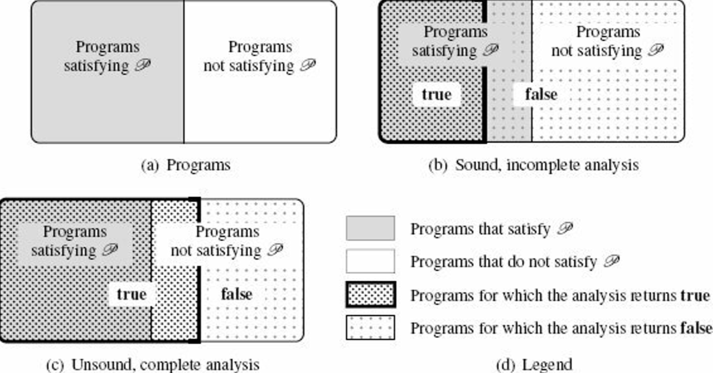

@def title       = "Introduction to Static Analysis"
@def pubdate     = "2021-04-17"
@def description = "a random note taken during the reading \"Introduction to Static Analysis\""
<!-- @def rss_pubdate = Date(2021, 4, 17) -->
<!-- @def rss         = "a random note taken during the reading \"Introduction to Static Analysis\"" -->

\newcommand{\theorem}[2]{
  @@theorem
    @@admonition-header Theorem: #1 @@
    @@admonition-body #2 @@
  @@
}
\newcommand{\q}[1]{@@theorem-quote #1 @@}
\newcommand{\definition}[2]{
  @@definition
    @@admonition-header Definition: #1 @@
    @@admonition-body #2 @@
  @@
}
\newcommand{\example}[2]{
  @@example
    @@admonition-header Example: #1 @@
    @@admonition-body #2 @@
  @@
}

{{ blogtitle }}

This is a random note I took while reading
["Introduction to Static Analyis – An Abstract Interpretation Perspective"](https://mitpress.mit.edu/books/introduction-static-analysis), by Xavier Rival and Kwangkeun Yi.

# 1\. Program Analysis

## 1.3 Concepts in Program Analysis

### 1.3.2 Static versus Dynamic

Motivations for static analysis
- "before-use" analysis
- analysis of a program that might be never terminating

### 1.3.3 A Hard Limit: Uncomputability

\theorem{Halting problem}{
  The halting problem consists in finding an algorithm `halt` such that,
  \q{for every program `p` ∈ 𝙻, `halt`(`p`) = **true** _if and only if_ `p` terminates}
}

\\

\theorem{Rice theorem}{
  Let 𝙻 be a Turing-complete language, and let 𝒫 be a nontrivial semantic property of programs of 𝙻. There exists no algorithm such that,
  \q{for every program `p` ∈ 𝙻, it returns **true** _if and only if_ `p` satisfies the semantic property 𝒫.}
}

So how to design a program analysis ?
- target a restricted class of programs: give up the "for every program `p`" part
- not always being able to provide an exact answer: give up the "_if and only if_" part

### 1.3.5 Approximation: Soundness and Completeness

Let `analysis` to be an analysis tool to determine whether this property holds:
\q{for every program `p` ∈ 𝙻, `analysis(p)` = **true** ⇔ `p` satisfies 𝒫.}
can be decomposed into a pair of implications:
\q{
for every program `p` ∈ 𝙻, `analysis(p)` = **true** ⇒ `p` satisfies 𝒫.\\
for every program `p` ∈ 𝙻, `analysis(p)` = **true** ⇐ `p` satisfies 𝒫.
}

#### Soundness

A _sound_ program analysis satisfies the first implication.

\definition{Soundness}{
  The program analyzer `analysis` is _sound_ with respect to property 𝒫 whenever, for any program `p` ∈ 𝙻,
  `analysis(p)` = **true** implies that `p` satisfies property 𝒫.
}

A sound analysis will reject all programs that do not satisfy 𝒫.

\example{Strong Typing}{
- good: well-typed programs will not present certain classes of errors
- bad: certain programs that will never crash may still be rejected
}

The soundness is easy to meet; we can simply reject any program.
Therefore, in practice, the design of a sound analysis will try to give a conclusive answer as often as possible.

#### Completeness

\definition{Completeness}{
  The program analyzer `analysis` is _complete_ with respect to property 𝒫 whenever, for every program `p` ∈ 𝙻,
  such that `p` satisfies 𝒫, `analysis(p)` = **true**.
}

The completeness is also easy to meet; we can simply never reject any program.
To be useful, a complete analyzer should often reject programs that don't satisfy the property of interest.

#### Soundness vs. Completeness

\relasset{}
@@caption Soundness vs. Completeness (adapted from Figure 1.2 from the book) @@

When a program analysis is automatic, it is either unsound or incomplete.

## 1.4 Families of Program Analysis Techniques

- _**Testing**_: check a finite set of finite program executions
  * unsound and complete
  * good: easy, very close to the actual runtime
  * bad: may not terminate, may not be deterministic (e.g. concurrent programs), not feasible to fully observe all executions
  * xref: [concolic testing](https://en.wikipedia.org/wiki/Concolic_testing) to improve coverage and accuracy
- _**Assisted Proof**_: rely on user-supplied invariants
  * 2 basic approaches:
    + based on theorem-proving tools (e.g. [Coq](https://coq.inria.fr/))
    + leverages a tool infrastructure to prove a specific set of properties over programs in a specific language (e.g. [dafny](https://github.com/dafny-lang/dafny))
  * good: often sound to respect to the model of the program semantics used for the proof, also complete up to the abilities of the proof assistant to verify proofs
  * bad: non-automated, requires significant time and expertise
- _**(Finite-State) Model Checking**_: exhaustive exploration of finite systems
  * use some kind of exhaustive (but efficient) enumeration and determine whether all executions satisfy the property of interest
  * good: automatic, sound and complete _with respect to the model_
  * caveat: verification is performed at the model level and not at the program level
    + a model of the program needs to be constructed (manually or by some automatic frontend means)
    + => the checking of the synthesized model may be either incomplete or unsound, _with respect to the input program_ (incompleteness or unsoundness is often introduced in the modeling stage)
  * often conservative: sound and incomplete with respect to the input program
- _**Conservative Static Analysis**_: automatic, sound, and incomplete approach
  * idea: finitely over-approximate the set of all program behaviors using a specific set of properties
  * many existing trials
    + [Astrée](https://www.absint.com/astree/index.htm): proves the absence of run-time errors in embedded C codes
    + [Infer](https://github.com/facebook/infer): detects memory issues in C/C++/Java programs
    + [JULIA](https://www.verifysoft.com/en_julia_static_analyzer.html): discovers security issues in Java programs
  * often sound and incomplete
  * we can think of unsound and complete static analysis
    + will answer very different kind of question
    + may guarantee that a given subset of the executions of the program can be observed, while it doesn't prove properties such as the absence of run-time errors
- _**bug finding**_: Relaxed error search, automatic, unsound, incomplete, based on heuristics
  * simplify the design and implementation of analysis tools and to provide lighter-weight verification algorithms
  * can be used to improve the quality of non-critical programs at a low cost
  * examples:
    + [JET.jl](https://github.com/aviatesk/JET.jl): JET is unsound and incomplete bug finder for Julia, thus falls into this category (as of now, at least)
    + [CBMC](https://www.cprover.org/cbmc/): extracts models from C/C++/Java programs and performs bounded model checking (i.e. explores models only up to fixed depths)

\table{
\tr{ \th{} \th{automatic} \th{soundness} \th{completeness} \th{object} \th{when} }
\tr{ \td{testing} \td{No} \td{No} \td{Yes} \td{Program} \td{Dynamic} }
\tr{ \td{Assisted Proof} \td{No} \td{Yes} \td{Yes/No} \td{Model} \td{Static} }
\tr{ \td{Model Checking of finite-state model} \td{Yes} \td{Yes} \td{Yes} \td{Finite Model} \td{Static} }
\tr{ \td{Model Checking at program level} \td{Yes} \td{Yes} \td{No} \td{Program} \td{Static} }
\tr{ \td{Conservative Static Analysis} \td{Yes} \td{Yes} \td{No} \td{Program} \td{Static} }
\tr{ \td{bug finding} \td{Yes} \td{No} \td{No} \td{Program} \td{Static} }
}
@@caption an overview of program analysis techniques @@

# 2\. A Gentle Introduction to Static Analysis

## 2.2 Abstraction

\example{Semantic Property of Interest: Reachability}{
Realistic application for C programs:
- where it dereference a null pointer
- where it writes over a dangling pointer
}

\\

\definition{Abstraction}{
We call _abstraction_ a set 𝒜 of logical properties of program states, which are called _abstract properties_ or _abstract elements_.
A set of abstract properties is called an _abstract domain_.
}

\\

\definition{Concretization}{
Given an abstract element $a$ of 𝒜, we call _cocnretization_ the set of program states that satisfy it.
We denote it by $\gamma(a)$
}

Abstraction is not unique – some abstractions yield simpler computer representations and less costly algorithms than others:
\definition{Best Abstraction}{
We say that $a$ is the _best abstraction_ of the concrete set $S$ if and only if
- $S \in \gamma(a)$, and
- for any $a^{\prime}$ that is an abstraction of $S$ (i.e., $S \in \gamma(a^{\prime})$), then $a^{\prime}$ is a coarser abstraction than $a$
If $S$ has a best abstraction, then the best abstraction is unique.
When it is defined, we let α denote the function that maps any concrete set of states into the best abstraction of that set of states.
}

The best abstraction may not be available. Butt he impossibility to define or compute the best abstraction is in no way a serious flow for the analysis,
as it just lead to conservative but sound results.

\example{Example abstractions}{
Think of the "reachability" semantic property of a program that acts on 2D space:

\table{
\tr{\th{abstraction} \th{idea} \th{}}
\tr{
\td{intervals abstraction}
\td{the abstract elements of the interval abstract are defined by constraints of the form $l_{\rm{X}} ≤ \rm{X}, \rm{X} ≤ h_{\rm{X}}, l_{\rm{Y}} ≤ \rm{Y}, \rm{Y} ≤ h_{\rm{Y}}$}
\td{
- always has the best abstraction
- **non-relational**
- simpler, more efficient representation
} }
\tr{
\td{convex polyhedra abstraction}
\td{
the abstract elements of the convex polyhedra abstract domain are conjunctions of linear inequality constraints, e.g.
- $\rm{X} - \rm{Y} ≥ -0.5$
- $\rm{X} ≤ 2.5 $
}
\td{
- may not have the best abstraction
- **relational**
- more expressive, but more complex and less efficient
} }
}

}

## 2.3. A Computable Abstract Semantics: Compositional Style

A compositional approach to static analysis: to analyze a sequence of commands, "composes" the analyses of each sub-command

### 2.3.1 Abstraction of Initialization
