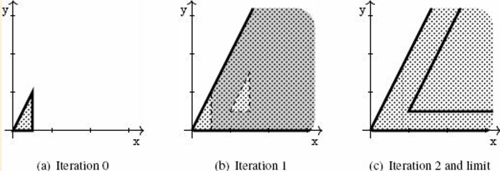

@def title       = "Chapter 2 — A Gentle Introduction to Static Analysis"
@def pubdate     = "2021-04-21"
@def description = "A note on \"Introduction to Static Analysis\", Chapter 2 — A Gentle Introduction to Static Analysis"
@def rss_pubdate = Date(2021, 4, 21)
@def rss         = "A note on \"Introduction to Static Analysis\", Chapter 2 — A Gentle Introduction to Static Analysis"

{{ blogtitle }}

# 2.2 Abstraction

\example{Semantic Property of Interest: Reachability}{
Realistic application for C programs:
- where it dereference a null pointer
- where it writes over a dangling pointer
}

\\

\definition{Abstraction}{
We call _abstraction_ a set 𝒜 of logical properties of program states, which are called _abstract properties_ or _abstract elements_.
A set of abstract properties is called an _abstract domain_.
}

\\

\definition{Concretization}{
Given an abstract element $a$ of 𝒜, we call _concretization_ the set of program states that satisfy it.
We denote it by $\gamma(a)$
}

Abstraction is not unique – some abstractions yield simpler computer representations and less costly algorithms than others:
\definition{Best Abstraction}{
We say that $a$ is the _best abstraction_ of the concrete set $S$ if and only if
- $S \in \gamma(a)$, and
- for any $a^{\prime}$ that is an abstraction of $S$ (i.e., $S \in \gamma(a^{\prime})$), then $a^{\prime}$ is a coarser abstraction than $a$
If $S$ has a best abstraction, then the best abstraction is unique.
When it is defined, we let α denote the function that maps any concrete set of states into the best abstraction of that set of states.
}

The best abstraction may not be available. But the impossibility to define or compute the best abstraction is in no way a serious flow for the analysis,
as it just lead to conservative but sound results.

Think of the "reachability" semantic property of a program that acts on 2D space:
\table{
\tr{\th{abstraction} \th{idea} \th{}}
\tr{
\td{intervals abstraction}
\td{the abstract elements of the interval abstract are defined by constraints of the form $l_{\rm{X}} ≤ \rm{X}, \rm{X} ≤ h_{\rm{X}}, l_{\rm{Y}} ≤ \rm{Y}, \rm{Y} ≤ h_{\rm{Y}}$}
\td{
- always has the best abstraction
- **non-relational**
- simpler, more efficient representation
} }
\tr{
\td{convex polyhedra abstraction}
\td{
the abstract elements of the convex polyhedra abstract domain are conjunctions of linear inequality constraints, e.g.
- $\rm{X} - \rm{Y} ≥ -0.5$
- $\rm{X} ≤ 2.5 $
}
\td{
- may not have the best abstraction
- **relational**
- more expressive, but more complex and less efficient
} }
}

# 2.3 A Computable Abstract Semantics: Compositional Style

A compositional approach to static analysis: to analyze a sequence of commands, "composes" the analyses of each sub-command

## 2.3.1 Abstraction of Initialization

## 2.3.2 Abstraction of Post-Conditions

- _abstract pre-condition_: an abstraction of the states that can be observed _before_ a program fragment
- _abstract post-condition_: an abstraction of the states that can be observed _after_ that program fragment
- _transfer function_: an abstract operation that accounts for the effect of a basic program statement

\definition{Sound analysis by abstract interpretation in compositional style}{
We consider a static analysis function `analysis` that inputs a program and an abstract pre-condition and returns an abstract post-condition.
We say that `analysis` is sound if and only if the following condition holds:
\q{
If an execution of `p` from a state (`x`, `y`) generates that state (`x′`, `y′`),\\
then for all abstract element $a$ such that (`x`, `y`) ∈ γ($a$),\\
(`x′`, `y′`) ∈ γ(`analysis`(`p`, $a$))
}
}

The definition above entails that:
- the analysis will produce **sound** results in the sense of [the soundness definition](#soundness)
  when considering the property 𝒫 of interest.
  Since the analysis over-approximates the states the program may reach, if it claims that 𝒫 is not reachable, then we are sure that the program cannot reach 𝒫.
- the analysis is not complete in the sense of [the soundness definition](#soundness), since it accepts analyses that produce coarse over-approximations

## 2.3.3 Abstraction of Non-Deterministic Choice

Abstract interpretation will produce an over-approximation of both cases, as the `union` of two sets of abstract elements.

\note{Note}{
This is another reason for the incompleteness of the analysis: it cannot express precise disjunctive properties
(the several solutions will be presented in section 5.1).
}

## 2.3.4 Abstraction of Non-Deterministic Iteration

\note{An interesting fact about static analysis}{
No analysis can ensure that an iteration will terminate with the abstract post-condition (even if computed),
because the halting problem cannot be computed exactly in finite time.
}

- setup:
  * program `p` consists of a loop with body `b`: `p` $::=$ `iter{ b }`
  * $\tt{b}_k$: program that iterates `b` $k$ times
  * $\tt{p}_k$: program that iterates `b` at most $k$ times
    + implies: $\tt{p}_{k+1}$ is equivalent to $\tt{p}_k$ or $\{\tt{p}_k; \tt{b}\}$
- idea: recursively applies analysis
  * $\tt{analysis}(\tt{p}_{k+1}, a) = \tt{union}(\tt{analysis}(\tt{p}_k, a), \tt{analysis}(\tt{b}, \tt{analysis}(\tt{p}_k, a)))$
  * $\tt{R} \leftarrow \tt{union}(\tt{R}, \tt{analysis}(\tt{b}, \tt{R}))$
  * analysis converges if `R` stabilizes
- approach: force the number of abstract elements to decrease over iteration
  * `widen`ing: over-approximates `union`s, enforces convergence
    * $\tt{widen}(a_0, a_1)$:
      * keeps all constraints of $a_0$ that are also satisfied in $a_1$ and
      * discards all constraints of $a_0$ that are not satisfied in $a_1$ (hence to subsume $a_1$)
  * `inclusion`: inputs abstract elements $a_0, a_1$ and returns **true** only when it can prove that $γ(a_0) ⊆ γ(a_1)$

Algorithm: $\tt{analysis(iter\{p\}}, a)$
```
R ← a;
repeat
    T ← R;
    R ← widen(R, analysis(p, R));
until inclusion(R, T)
return T;
```

\note{Note}{
Widening is another source of potential incompleteness,
but fortunately there are many techniques to make the analysis of loops more precise.

\example{Loop unrolling}{
To unroll the first iteration of the loop into the union of `{{}; b}` can ease the effect of the succeeding widenings.
\table{
\tr{ \th{} \th{program that acts on 2D space} \th{abstract iteration} }
\tr{ \td{original} \td{
```
init({(x,y) | 0 ≤ y ≤ 2x and x ≤ 0.5})
iter{
  translation(1, 0.5)
}
```
} \td{} }
\tr{ \td{loop unrolled} \td{
```
init({(x,y) | 0 ≤ y ≤ 2x and x ≤ 0.5})
{} or {
  translation(1, 0.5)
}
iter{
  translation(1, 0.5)
}
```
} \td{} }
}
}
}

## 2.3.5 Verification of the Property of Interest

The analysis discussed so far actually computes as intermediate results over-approximations for all the interesting states of the input program,
and thus we can just monitor them and use it for the verification of the property of interest.

# 2.4 A Computable Abstract Semantics: Transitional Style

Idea: compute, from the outset, all occurring intermediate states

## 2.4.1 Semantics as State Transitions

The goal of the analysis: to collect all the states occurring in all possible transition sequences of the input program.

- program: a collection of _statement_s with a well defined execution order
- _program counter (program point)_: a unique label assigned to each statement of the program
- _control flow_: the execution order, specified by a relation between the labels (from current program points to next program points)

The algorithm works very similarly to the "compositional style", but it will compute states _per statement_ and iterates until all the statement states get converged.

# 2.5 Core Principles of a Static Analysis

The three-stage approach for static analysis:
1. **selection of the semantics and properties of interest**
2. **choice of the abstraction**
3. **derivation of the analysis algorithms from the semantics and from the abstraction**
